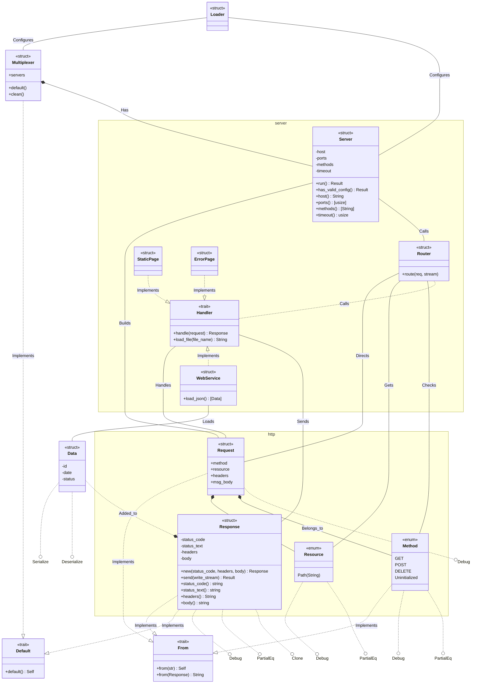
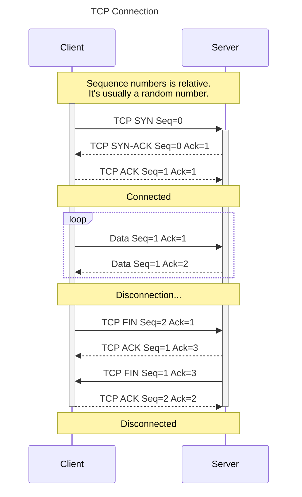

<h1 align=center>
    localhost
    <br>
    
</h1>

## Overview

- This is a project built on Rust and is supposed to emulate a localhost server and should be bindable to a port.

## Tech Stack

[](./src/main.rs)
[](./scripts/gitify.sh)
[](#table-of-contents)

### TCP Header

  ```mermaid
  ---
  title: "TCP Packet"
  ---
  packet-beta
  0-15: "Source Port"
  16-31: "Destination Port"
  32-63: "Sequence Number"
  64-95: "Acknowledgment Number"
  96-99: "Data Offset"
  100-105: "Reserved"
  106: "URG"
  107: "ACK"
  108: "PSH"
  109: "RST"
  110: "SYN"
  111: "FIN"
  112-127: "Window"
  128-143: "Checksum"
  144-159: "Urgent Pointer"
  160-191: "(Options and Padding)"
  192-255: "Data (variable length)"
```

## Architecture

```mermaid
architecture-beta

  group localhost(logos:rust)[localhost]
  group source(logos:rust)[source] in localhost
  group servers(logos:rust)[servers] in source
  group http(logos:rust)[http] in source

  service config(logos:toml)[config] in localhost
  service templates(logos:html-5)[templates] in localhost
  service data(logos:json)[data] in localhost

  service loader(logos:aws-config)[loader] in source
  service multiplexer(server)[multiplexer] in source

  service root(server)[root] in  servers
  service middlewares(logos:aws-lambda)[middlewares] in servers
  service router(logos:react-router)[router] in servers
  service handlers(logos:aws-step-functions)[handlers] in servers

  service requests(internet)[requests] in http
  service sessions(internet)[sessions] in http
  service responses(internet)[responses] in http

  junction builder in localhost

  config:R --> L:loader
  loader:R --> L:multiplexer
  requests:L --> R:multiplexer
  multiplexer:B --> T:root
  root:R <-- L:sessions
  root:L --> R:middlewares
  middlewares:B --> T:router
  router:R --> L:handlers
  builder:T --> B:handlers
  templates:L -- R:builder
  data:R -- L:builder
  handlers:R --> L:responses
```



### Classes



### Sequence


